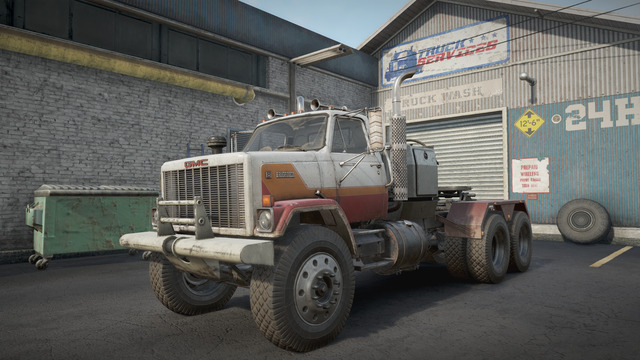
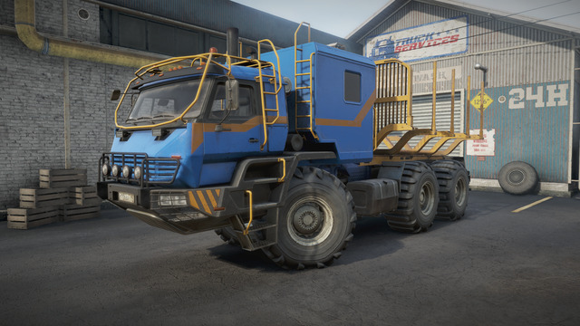

# SnowRunner Vanilla++

This mod was created to address the feelings of "I'd love to drive this truck more, but it can't pull this or carry that or gets stuck / tips over too often" that you get as you progress through the game.

If you feel like half the trucks in your garage are just not worth using anymore by the time you reach Taymyr, you might be the target audience for this.

**Note:** While the primary goal of this mod isn't to make the game easier, that *will* happen as a side effect of the changes it makes. If you already find this game too easy, this mod is not for you.

# How to Install

Grab the latest release from here: https://github.com/vsTerminus/SnowRunner/releases/latest

Download `initial.pak` (or if that doesn't work, `initial.zip` and unpack it) and place overwrite the original in `Steam/steamapps/common/SnowRunner/preload/paks/client/`

**Note 1:** You will need to repeat this every time SnowRunner receives a patch, or if you ever have Steam validate the files (including moving the game to a new location). If you forget to do this and load up your profile, any modifications you made to your trucks that weren't possible in Vanilla will get reset.

**Note 2:** If you decided to make a backup of the original initial.pak you should move it out of the "client" folder, as the game will attempt to load _all_ .pak files in this location, including your backup.

# How to Uninstall

Have Steam verify files. It will download a fresh copy of `initial.pak`.

# For Modders

If you want to modify my files with your own changes, or just prefer to install things manually, here are the steps. **Regular Users can ignore these steps.**

In your `Steam/steamapps/common/SnowRunner/preload/paks/client/` directory you will find a file called `initial.pak`. Open it with **WinRAR**.

Yes, WinRAR. The short explanation is that other archive tools such as 7zip don't read Snowrunner .pak files correctly, or sometimes they can read and extract but cannot update them and that is what we need to do here. For whatever reason, WinRAR "just works" with SnowRunner's .pak files. Even on Linux, your best bet is to just install the Windows version of WinRAR using WINE, specifically wine-ge.

With `initial.pak` open, simply drag in the `[media]` folder from this repository and click OK. WinRAR will overwrite the existing files with the ones from this mod. When it finishes you can close WinRAR and launch SnowRunner as normal.

# List of Changes

## Other mods that my mod integrates

There are others out there who have made manual-install mods like this one, but the problem is that combining these is sometimes difficult; If two mods edit the same file they will conflict and one wil overwrite the other.
So I cannot simply say "Install my mod and also these other ones" because of conflicts, particularly with the ElfVierzhen mods. Instead, I have to build my changes _on top of these other mods_, using them as a baseline. So my mod must also include and distribute these mods.

### "Fuel capacities based on real data" by ElfVierzhen

https://mod.io/g/snowrunner/m/fuel-capacities-based-on-real-data

My mod fully integrates this mod as it fits perfectly with the goal of my efforts. This mod re-balances fuel tank size and engine fuel flow rate so that _most trucks_ can run for 30-50 minutes on a tank of gas. Some, because of their very large fuel tanks or because they share engines with other trucks, will be able to run for longer. This mod alone made a world of difference for me, as the Paystar 5600TS no longer needed refueling every *10 minutes*. I was playing "Fuel Truck Logistics" more than anything else and it made me never want to drive certain trucks as a result. This mod addresses that problem in a way that feels good without removing the need for fuel entirely; I still have a fuel truck but it's much less necessary than it used to be.

### "Actual Snow Chains" by ElfVierzhen

https://mod.io/g/snowrunner/m/actual-snow-chains

Another mod along the same lines, this one solves the issue of making snow chain tires being worthless in mud when in reality they are actually quite useful. Unlike the Fuel Capacities mod which I integrated as-is, I have updated all of the tire stats in the game on top of this so I may not need to integrate this mod anymore.

### "Camera Clipping Fix" by McKillem

https://mod.io/g/snowrunner/m/manual-camera-clipping-fix

This mod stops the camera from launching into the sky whenever it hits objects like telephone poles and watchtowers by removing the camera collision from them. It does not affect larger solid objects (like buildings). This is a really nice QoL thing I could not go back to playing without.

## Non Truck-Specific Changes

These changes are not truck-specific, such as tires and engines which are used by multiple trucks in the game.

### All trucks purchaseable anywhere

By simply removing the country codes from the "Country" property in each truck file, the game will allow you to purchase them anywhere without needing to move to a different region. IMO this was a dumb restriction that just wasted your time, as there was never anything stopping you from changing regions to go buy a truck. It just wasted your time staring at loading screens.

This affects all trucks in the game.

### All tires ignore ice

I wanted a more nuanced solution here but while asphalt, dirt, and mud/snow all have friction modifiers you can tune and adjust, ice only has a simple on/off toggle. Either the tires ignore ice or they don't.
Alternatively I could have created "studded" versions of tires that didn't have chain tire options but they wouldn't have been visually different and honestly the larger goal is to decouple tire appearance from tire stats so I just settled for making all tires ignore ice.

### Tire stats homogenized within each category

It always bugged me that the three variations of each tire all had slightly different stats, and that you needed a spreadsheet to keep track of exactly what those differences were. It also meant that you almost always pick the one with the "best" stats and ignore the others even if you prefer the way they look.
My idea was to simply take the best stats from each section (Highway, All Terrain, Off Road, Mud) and make every tire in the category share those stats instead of being slightly different.

I also bumped the stats across the board so tires are overall better than they used to be. This helps out a lot of the weaker trucks which struggled more in the mud, but also significantly improves asphalt traction for off road and mud tires (because in reality those tires are still just fine on paved surfaces and it sucks sliding around like you're on ice).

**To-Do: Provide a table with the current tire stats**

### Russian "Modern Scout" engines receive a small power boost

Some of the Russian scouts are pretty heavy and this boost helps them feel like they can move better under their own weight.

### US "Old Top" engine gets a power boost

This benefits trucks like the Chevy Kodiak C70 and the White Western Star which are good little trucks but really lack power.

### "Fuel Tank" frame addon capacity increased from 1500 to 2500

This is based on how much fuel you can fit in the other fuel trailers. The frame addon is significantly larger than the Scout fuel trailer which holds 900, and very similar to the dolly fuel trailer which holds 2000.

### "Long Fuel Tank" frame addon capacity increased from 2800 to 4000

Again based on the capacities of the large fuel tank trailers and the size difference of the regular and long fuel tank frame addons. 4000 feels about right, and with the increased fuel tank sizes from ElfVierzhen's mod you will use 1/4 or more of the tank filling a single truck with the superheavies.

### "Tatra Fuel Tank" frame addon capacity increased to 2500

Same idea as the regular fuel tank, but Tatras have their own unique looking one.

### "Crocodile Fuel Tank" frame addon capacity increased from 900 to 1500

The Crocodile also has its own unique fuel tank addon. It looks larger than the scout fuel trailer to me, so it gets a bump.

### Farm Trailers can now be packed on the towing frame addons

This change reduces the number of wheels required to make contact with the towing platform in order for the "Pack Trucks and Trailers" option to appear. The default is 4, this reduces it to 2. Packing the farm trailers is still sketchy as all hell and doesn't work *great*, but at least you can do it now.

## Truck-Specific Changes

These changes are made to affect a single truck. In most cases it will mean larger tire sizes  and the addition of or changes to AWD and Diff Lock. Sometimes there are additional engine options, additional frame addons, weighted bumpers, and new or modified suspension options as well.

For the smaller trucks, these changes aim to make them feel "viable" in late game and in DLC regions by giving them the things there doesn't seem to be a good reason for them *not* to have; Larger tires, taller suspension, more power, and sometimes room for more attachments where it makes sense and there is room.

In the case of the superheavies, they are already viable late game but many of them only get access to saddles and heavy cranes making them very situational picks, or you use them anyway and just drag stuff around with the winch. Neither is very appeaing. So if these trucks have room on the frame for minicranes and flatbeds and van bodies and logging racks then I say "Why not?"

Hopefully this helps with feelings of "I want to drive this truck but because it doesn't have X or can't pull Y or gets stuck so easily it stays in my garage".

### BOAR 45318

- Can fit 61" Tires
- Has access to heavier tires including mud singles
- Can fit flatbed, sideboard bed, and a low saddle
- Converted High suspension into Active suspension

The BOAR is a cool truck but it suffers from an abysmal approach angle, is limited to on-road tires, and has a lack of options for cargo and trailers.
To help it I added larger tires and heavier tires, but the rear axles are too close together for anything larger than 61". These tires still fit under the Stock suspension, so I added an Active suspension option to further help with the approach angle when needed, while still allowing you to lower the frame to get under trailers.
The addition of the low saddle and cargo beds allows it to be used for a wider variety of jobs.

### GMC MH9500

- Can fit 51" tires
- Has a manual diff lock
- Gets a High Hauling suspension
- Gets a weighted front bumper for heavy towing
- Gets improved saddle placement
- Engine fuel consumption reduced to be in line with similar engines

This is one of the early game highway trucks that very quickly feels useless later on. A lot of that is fixed by simply giving it larger tires and a diff lock, but because I quite like this truck I did more.
The High Hauling suspension is stiffer, and when combined with the weighted front bumper you can now comfortably pull some heavy loads and still be able to steer.
I also adjusted the saddles to put the weight directly on top of the axles.

(Some trucks in this list benefit from personal preference and this is one of them)

### Derry Longhorn 4520

- Gets an additional, even more powerful engine
- Gets Active suspension
- Gets two larger tire sizes (53" and 55")

This is one of those trucks that needs the *most* help. You may recall that Saber already significantly boosted its engine power after it was released and people realized it could barely climb a hill *without* a load, nevermind with one. Unfortunately, even with that boost I still felt it wasn't enough for this truck to perform the way it should so I boosted it again.
I also added larger tires because there was clearly room for them, and I find with all of the superheavy trucks that Active Suspension really helps with approach angle when needed, while still allowing you to get under a trailer.
IMO this truck feels really good to drive now.

### Zikz 605r

- Can fit a Low Saddle
- Gets a Bandit Crane
- Gets Active Suspension
- Tires from the JAT DLC now match the size of the Vanilla tires (They were 10" smaller)
- Can pull scout trailers
- Can fit articulated towing platform
- Can fit 1-slot flatbed

You might say "The Zikz 605r is the best truck in the game, why are you modifying it???" and that would be a very valid question. Let's just say it's getting preferential treatment, and you don't have to make use of any of these changes if you don't want to.
The addition of the Low Saddle and Bandit Crane make it useful for more job types, and Active Suspension helps with very low trailers that need a little more clearance.
The tires from the JAT DLC being 10" smaller bugged me so I changed that.
The scout trailer, 1-slot flatbed, and towing platform were much more "because I can and it might be fun" additions that don't make the truck any more useful than it already is.

### Pacific P12W

- Can fit 3-slot flatbed and sideboard
- Gets manual locking diff
- Gets access to Derry Longhorn 4520 engines
- Gets 65" and 69" tires

This is another one of those trucks that can barely move its own weight with the vanilla engines and also requires a pretty significant engine boost. Since the Derry Longhorn 4520 has its own exclusive engine set I just gave the P12 access to those instead of adjusting the power of the P12 engines which are shared with other trucks.
Also, there are brochures for the P12 which explicitely state it can come with 69" tires so that's what I put on this one.
The manual locking diff is the last piece of the puzzle to help this incredibly heavy truck get up a hill with any meaningful payload.
Finally, the long flatbed fits on the frame so why shouldn't the truck be able to use it?

### Pacific P16

- More powerful engines
- Three larger tire sizes
- Superheavy Single tires
- All Wheel Drive
- Short and Medium Logging Frame Addons
- CAT 745C Logging Frame Addon
- Articulated Towing Platform

Again, ridiculous for any truck in this game to not include AWD - Even the P16. It feels pretty damn powerful when you first find it in Michigan and then you try to bring it to Alaska or Taymyr and it quickly bogs down with RWD, tiny wheels, and overall lack of power.
Even after initially modifying it to just include AWD, larger tires, and more power, I still found myself not using it because it could really only do vanilla long logs. I really wanted to be able to use the mod logging frames and trailers, so I gave it what it needs for those.
Along with the new tires, it's actually a truck I want to drive now.

### Pacific P512

- Can fit 59" tires
- Now has All Wheel Drive
- Can fit a crane and a van body at the same time (I know, weird combo. But there's room so why not?)
- Increased engine power

The P512 is not a bad truck to begin with, but the lack of AWD for *any* truck in this game is ridiculous so that had to be fixed.
It very clearly has room for larger tires, though going from 51" to 59" might be pushing it a little. Still, it only has the Off Road Heavy Dually tires and no suspension options so the larger size and increased engine power helps it get through some of the more difficult maps, especially with cargo or trailers.

### Ford CLT9000

- Gets Limited Slip (Always-On) Diff
- Gets All Wheel Drive
- Gets 45" Tires

Honestly this one could probably use *more* tuning as it's still not a particularly powerful truck and the suspension is quite soft, but at least now it can actually leave the pavement and not immediately need rescuing.

### International Transtar 4070A

- Gets All Wheel Drive
- Gets Limited Slip (Always-On) Diff
- Gets 43" and 47" tires

Like the Ford CLT9000, this is a truck you'll probably never use because it comes without a diff lock or AWD. At least Saber added a High suspension unlock to it, but it's an unlockable in a DLC map.
Anyway this attempts to make it at least *functional* by giving it AWD and LSD, and some larger tires for when you get the high suspension unlocked.
This one could probably also benefit from more tuning.

### International Paystar 5070

- Can fit 49" and 52" tires
- Installed a level-kit (Raised the height of rear suspension to match the height of the front)
- Added two more engine options

The Paystar 5070 is a great early game truck for a variety of purposes - I like it as a crane truck for example. But it suffers from only having one engine, it has the Cali Lean suspension, and can only fit tiny tires. It seems to be balanced *only* for early game and quickly becomes less useful later on.

By giving it larger tires, more powerful engine options, and fixing the suspension the 5070 gets to stay relevant forever.

### International Paystar 5600TS

- Can fit 55" tires
- Can fit a High Saddle
- Can fit an Articulated Towing Platform
- Can fit a rear mounted Log Lift
- Can fit a rear mounted Minicrane
- Moved most frame addons forward for better weight distribution
- Possible to fit a 2 slot flatbed and a low saddle at the same time

The only thing wrong with the Paystar 5600TS in Vanilla is its tiny fuel tank and abysmal fuel flow rate - Both of which are addressed by the Fuel Capacities mod included here.
But beyond that, the 5600TS has a long frame and vanilla doesn't make good use of it with the frame addons shoved to the back and not many combo options possible. I've moved most addons forward and included rear-mounted Minicrane and LogLift options.
Also for fun, I made the two-slot frame addons not conflict with the Low Saddle and repositioned the saddle as far back as it could reasonably go. This makes it possible to fit *some* semi trailers with *some* (mostly the flatbed) frame addons without issue.

### International Fleetstar F2070A

- Can fit 47" tires

Not much else to do with this truck. It already has AWD, Diff Lock, plenty of frame attachments, and good power. All it really needed was some larger tires to help with deep mud.

### Royal BM17

- Gets Limited Slip (Always-On) Differential

Nothing fancy for this truck, it just lacked a diff lock so now it at least has LSD to help it along.

### Chevy Kodiak C70

- Can fit 47" tires
- Tires have a much wider stance for improved stability
- Can fit heavy tires, both double and singles
- Can fit several new kinds of Frame Addons, including the F-750's pickup bed, log bunks, fuel/water tanks, 1-slot flatbed, 2-slot flatbed, big crane, and articulated towing platform
- Can fit multiple frame addons at a time where it makes sense (eg radar + utility addon + pickup bed)
- Can pull scout trailers
- Can fit medium autonomous winch
- Can fit a larger, more powerful engine
- Saddles moved closer to the axle for improved stability
- Can fit weighted bumper for heavy hauling
- Gets "High Hauling" and "Tuned Custom" suspensions
- Moved to the "Scout" category

The Kodiak is almost certainly the most modified truck here.

The vanilla truck is extremely tippy and has some pretty silly limitations on what it can and can't fit on the frame. Also, the saddle is so far back that any significant weight will make the single axle function like a fulcrum, popping the front of the truck up into the air.
I first attempted to make the Kodiak a better hauler by adjusting the saddle position and giving it tow/haul suspension and a weighted bumper, along with larger tires with more offset to help it stay rubber-side-down, but the long frame and single axle forever make it somewhat subpar, even compared to the GMC MH9500.
After that I leaned more into the Scouting capabilities of this truck, letting it pull scout trailers, giving it the scout winch (the medium one from the TUZ Actaeon), and giving it a suspension suited to bombing around the map. Finally I just outright moved it into the Scout category where I think it belongs.

I really like the Kodiak so it serves as a bit of a testbed for me, but also I want it to be a fun truck and now I think that it is.

### TUZ 16 Actaeon

- Can fit saddles
- Can fit a weighted bumper
- Can pull scout trailers
- Moved to Scout category

This is a fun little truck with an autonomous winch, but it can't pull saddle trailers by default and I thought that might be fun. Because it's so small it also needs the weighted bumper to keep the front tires on the ground.
It's not a particularly *good* trailer hauler, and with the big mud tires and autonomous winch it's probably a better scout than anything, so that's where I moved it.

### Kolob 74760

- Gets High Suspension
- Can fit 65" tires
- Can fit logging beds
- Can fit a Low Saddle
- Improved High Saddle location, slightly raised articulation point
- Gets Manual Locking Differential
- Gets Articulated Towing Platform

You might say "The Kolob 74760 is the best truck in the game, why are you modifying it???" and that would be a very valid question. Let's just say... Like the Zikz this is a particular favorite of mine and it's already the truck you use when you just want the job to be get done without any more delays, so why not make it just a little better?
The larger tires and raised suspension are mostly unnecessary but there are some cases where it really benefits from the extra clearance as it's a long and very rigid truck.
The logging beds, low saddle, and towing platform expand the job types you can take with this truck, and the High Saddle is moved for better articulation with heavy trailers.
At the end of the day I just wanted to be able to use this truck for more jobs and in more situations, and now I can.

### Voron Grad

- Can fit 54" tires

This truck is already very good, but it looked like there was room for one more size of tires so I added it.

### Khan 317 Sentinel

- Can fit 45" tires

The Sentinel doesn't need much except bigger wheels to help it through the deeper mud and snow. This allows it to be a viable scout even in the DLC regions.

### Freightliner 114SD

- Gets access to an additional, more powerful engine
- Can fit 51" tires

The 114SD is a pretty good truck already with lots of frame attachments, AWD, Diff Lock, etc, but it's underpowered and can't use mud tires so it struggles in mud and on hills. These changes help with that.

### Step 310E

- Can fit 47" tires
- Increased height of "Raised" Suspension
- Added a "High Hauling" Suspension

Like the 114SD this truck is already pretty good, but the stock suspension is quite soft and the raised suspension isn't very raised. Improving the suspension lift and adding another option with more strength allows the Step 310E to carry the heavy crane or a fuel tank or pull a larger trailer without bottoming out. It also can't fit mud tires, so the larger size offroad tires also help it deal a little better with the deep stuff.

### Step 33-64 "Crocodile"

- Can fit 44" tires
- Can fit heavy tires
- Fuel tank size increased to 300L to match real world data
- Increased height of the "Raised" Suspension
- Can fit Medium Autonomous Winch
- Can pull Scout Trailers
- Moved to "Scout" category
- Gets a weighted bumper to help with steering while towing
- AWD and Diff Lock converted from always-on to selectable
- Can fit the 1-slot flatbed

Even with the larger tires, the Crocodile falls into a very similar category as the TUZ 16 Actaeon; It's *capable* of pulling trailers but it's not particular *good* at it. Instead, the big mud tires and limited attachments make it a better scout than anything else, so I gave it the Actaeon's autonomous winch, allowed it to pull scout trailers, and moved it to the scout category.

### YAR 87

- Gets an additional, more powerful engine option

The YAR 87 is a HEAVY scout and shares engines with much lighter scouts, so it suffers from a poor power to weight ratio. Giving it access to a heavier truck's engine puts its performance back in line with other scouts.

### Tatra T813

- Can fit 55" tires
- Can fit a Low Saddle
- Can fit a 1-slot flatbed
- Can fit a minicrane or a bandit crane

The T813 is already a great truck, but suffers a bit from low clearance and lack of crane attachment. It can fit the larger 55" tires under the stock suspension so I added them. The mini cranes are useful when pulling a trailer, and there was room left for a 1-slot flatbed so I figured "why not?" You'll probably want to run the crane with a saddle, however.

### Tatra FORCE T815-7

- Can fit 54" and 57" tires
- Can fit a Low Saddle

The Tatra FORCE is honestly such a good truck, it's another one that got some preferential treatment because I like it a lot. The larger tires really allow it to go just about anywhere, and the Low Saddle lets it pull more kinds of trailers.

### Tatra PHOENIX

- Can fit 49" and 52" tires
- Moved crane up against the cab
- Can fit a Low Saddle

Like the FORCE the PHOENIX doesn't need a lot of help, but the default crane placement was silly so I moved it up against the cab and now it can fit a crane + sideboard at the same time.
It also gets some larger wheels allowing this truck to go just about anywhere as well.

### GMC Brigadier 8000

- Can fit 48" and 51" tires
- Gets a weighted bumper for towing

The Brigadier comes with Raised and Tuned Custom suspension, so it only made sense to give it tires that utilize the increased ride height. It can't fit mud tires, so the larger wheel size helps with deep stuff.
Also, the only reason it can't pull some of the heavier trailers is because they lift the front end and take away your ability to steer. The weighted bumper option helps with that.

### White Western Star 4964

- Can fit 47" and 51" tires
- Gets a weighted bumper for towing

The White Western Star gets exactly the same treatment as the Brigadier because it has exactly the same weaknesses; No mud tires, limited clearance, difficulty towing heavy trailers. Otherwise it's a good truck.

### Azov 42-20 Antacrtic

- Converted to traditional steering with improved turning radius and responsiveness
- Slightly wider stance for improved stability
- Price reduced to 90000, unlocks at level 10 (instead of 26)
- Gets access to Derry Longhorn 4520 Engines for better power to weight ratio
- Gets CAT CT680's horn sound
- Gets selectable All Wheel Drive
- Can fit several new attachments including heavy crane, logging bunks, flatbeds and sideboards, minicranes, tanks, and more

The Antarctic is also competing for most-modified truck in the list. The Chassis Steer isn't enjoyable so I have converted it to traditional steering with an improved turning radius and steering speed, it should feel much better to drive around now. It is also one of those trucks that is so heavy that it can't climb a hill properly, so I gave it access to the Derry Longhorn 4520's engine which seems to be a good fit.

The Antarctic's horn is teeny tiny sounding so I replaced it with a much better one.

Yet another truck without AWD, in a game where AWD is essentially mandatory. Cool cool.

This is also the only truck where I have modified the price and unlock level, as 26 felt like it was waaaaaay too late for how useful the truck was(n't). So now you can unlock it sooner, and for a bit less money.

Anyway, the Antarctic is now much less frustrating to drive and can handle a very wide variety of missions it couldn't do before.

### Western Star 6900 TwinSteer

- Can fit 63" tires
- Lowered center of gravity for improved stability

The TwinSteer was for the longest time the only truck that could pack 4-slot cargo without a trailer (It is now joined by the FEMM 37-AT), but it came at the cost of not being able to equip *literally any other frame attachments*. That part is fine, but the main reason I never used this truck was because of how tippy it felt. So I lowered the center of gravity and it's ... better now. Still tippy, but at least you can take a corner without rolling over for a nap.

### Rezvani Hercules 6x6

- Can fit duallies

It just really looked like it should be able to, so now it can. Helps with stability, which is nice.

### Land Rover Defender 90

- Can fit 35" tires
Not much to say. It could fit the larger tires so I added them.

### Land Rover Defender 110

- Can fit 35" tires

Same deal as the 90.

### Western Star 57X

- Can fit 46" and 47" tires
- Gets manual locking diff

The 57X is generally in a pretty good place, but the lack of diff lock is a problem so I fixed that, and while I was there I added some slightly larger tires because it had room for them.

### Western Star 47X NF1424

- Can fit 51" tires

Another truck that doesn't need much, just some larger wheels because it has room for them and they help with the deeper mud/snow pits.

### Western Star 47X NF1430

- Gets Manual Diff Lock
- Gets 3-Slot Flatbed and Sideboard
- Can fit 47" and 50" tires
- Can fit mud tires

The 1430 is the long-frame version with *two* dead lift axles. It can fit more attachments because of the frame length, but it needed more help than the 1424 did. Diff lock, larger tires, and access to mud tires turn it into a pretty capable truck that feels just a little bit less pointless than it used to.

### Kirovets K-700

- Improved turning radius
- Improved steering responsiveness

I had initially converted this to selectable AWD and Diff Lock, but after some playtesting I've realized this wasn't the way to go so I reverted those changes.

That said, both tractors suffer from a turning radius of "eventually" and a very slow turning rate, making them a pain to drive around a field. I boosted the steering speed and angle so they turn sharper and do it faster.

### Kirovets K-7M

- Gets selectable AWD
- Gets manual diff lock
- Improved turning radius
- Improved steering responsiveness
- Raised intake height to match visible snorkel

Exactly the same treatment as the K700, for the same reasons. With the addition of making the dust snorkel into a functional water snorkel.

### Kenworth W990

- Gets AWD
- Gets manual diff lock
- Can fit 55" tires

The W990 doesn't need much other than the obvious AWD and Manual Diff Lock. It had room for larger tires as well so I added them. Otherwise good truck, aside from the dead lift axle.

### Kenworth 963

- Gets manual diff lock
- Engine torque increased

You might say "The Kenworth 963 is the best truck in the game, why are you modifying it???" and that would be a very valid question. As mentioned previously, always-on diff behaves like a Limited Slip diff so when you need actual traction that is a hindrance instead of a help. The manual diff lock behaves like a true locker, forcing all of the wheels to rotate at the same speed. The 963 really needs this for getting up the hills - Even with the increased engine power I gave it. This truck has its own unique set of engines so I simply boosted the power of all three because it was struggling to climb hills even without a payload. It's still not the best hill climber but at least it'll make it up now.

### Navistar 5000-MV

- Gets always-on (limited slip) differential
- Can fit 52" tires
- Can fit 1-slot flatbed
- Moved to the Highway category

The Navistar doesn't need much help, but the open diff also isn't doing it any favors. Addressing that and giving it larger tires should help it in the muddier regions.

### Ank Mk38 Civilian

- Can fit articulated towing platform
- Can fit 2-slot frame-addons
- Can fit a minicrane

The Ank doesn't need a lot of help, it just feels really limited on what jobs it can do because of the lack of frame attachments.

### KRS 58 Bandit

- Can fit 55" tires
- Can fit articulated towing platform
- Can fit regular minicrane

The Bandit is a good truck but has two minor issues: It can clearly fit some larger tires, and its crane catches on the roof rack and prevents body flex which leads to it tipping over. You can solve the latter by turning the crane around, but now you can also just take a regular minicrane if you like.

### FEMM 37-AT

- Converted to traditional steering
- Gets selectable AWD
- Can fit long tanks
- Can fit the Tatra crane
- Can fit logging bunks
- Can fit articulated towing platform
- Fuel tank increased to 1200L
- R2 engine produces slightly more power
- R2 engine consumes less fuel
- Minicrane moved to back of the frame
- Can fit the Azov Atom's 3-slot sideboard bed
- Can fit both forward-facing and rear-facing log lifts, both mounted at the rear of the frame

You might say "The FEMM 37-AT is the best truck in the game, why are you modifying it???" and that would be a very valid question. Let's just say... you get the idea. I really like this truck and I needed to modify it anyway to convert the steering so I spent some time adding all the frame addons that would fit because this truck is *long*. Also, because the fuel capacities mod seems to have disappeared, I took the pending changes that were supposed to come with that mod's next release and implemented them here: 1200L fuel tank, reduced fuel consumption by about 1/3. I also very slightly increased the engine power to help with hill climbs where it struggles a bit. I moved the minicrane to the back of the frame and tried to make as many things compatible as I could. You can fit either the Tatra Crane up front or the Mini Crane in the back and different addons will be compatible with each depending on where they best fit. Finally, for logging you can fit a Log Lift at the back of the frame and either point it forward or backward, the latter being nice if you plan to pull a trailer, and the former if you don't.

### Mack Defense M917

- Can fit 54" tires

The Mack Defense is already an extremely capable truck but it since it comes with both Active and High suspension already and there is clearly room for larger tires, we might as well add them.

### Aramatsu Forester

- Can fit 55" tires
- Shares engines with K7M

The Forester is a neat little truck, but it has room for larger wheels and feels a little underpowered. The K7M's engines are about right for the Forester, allowing it to actually be good at the one thing it can do.

### Azov 67096 "Atom"

- Can fit FEMM 4-slot Sideboard

The Atom can fit a 3-slot flatbed + a minicrane by default. It also gets a unique sideboard bed that is too long for the crane and looks like it should hold 4 slots, but it only holds 3. So I added an actual 4-slot sideboard bed out of spite. The Femm's float body sideboard hangs off the back making trailers unusable so if anything it makes the truck worse :P

### Burlak 6x6

- Engine power and durability increased
- Tires now inherit stats from the "ScoutMudtires" template instead of "Offroad"

The Burlak is already a really nice scout with a lot of flexibility, but with a "B" power to weight ratio it sometimes felt a bit weak, especially with a trailer. Also for some reason the tires had terrible mud stats because they were using the "Offroad" template for friction. Moving them to "ScoutMudtires" solves the problem nicely.

### Azov 64131

- Can fit 51" tires
- Gets a modest Raised suspension

The Azov is a powerful (albeit slow) truck that is really only held back by its ability to get through deeper mud and snow due to lack of clearance. Unfortunately there's not much room to increase tire size without significant visual clipping, but the addition of a Raised suspension option helps with that a little.

### CAT 770G

- Gets always-on AWD
- Gets improved steer speed
- Can fit non-JAT Superheavy Single tires
- Can fit regular Low and High Saddles

The 770G is a neat truck, even with CAT's usual strict limitations on modifications. It would be nice, however, if it was actually usable for anything outside of the heavy rock trailer jobs so now it can pull regular semitrailers too. Also, I continue to maintain that every truck in this game should have AWD, so now the 770G does too. The Jack of All Treads tire DLC gave the 770G the ability to fit the Superheavy Singles from the DLC, but Saber didn't bother adding the vanilla Superheavy Singles, so I did that. Now you don't need the DLC to have options. And finally, while I didn't touch the turning radius, I did moderately boost the steering speed so it feels a bit more responsive and can actually make a corner at speed now.

### Kenworth C500

- Gets "Raised" suspension option
- Can fit 54" tires, including superheavy singles

Saber did the C500 dirty - Especially when it first released. Do an image search for a Kenworth C500 and then compare it to what we were sold. The C500 is supposed to be BIG, but not only did they release it with tiny wheels and low suspension they put storage boxes right in front and big, permanent mudflaps right behind the tires so that any attempt to increase the wheel size would result in immediate and noticeable clipping. Thankfully they backed down on the mudflaps, but the boxes are still there and the rear axles don't move when you raise the suspension.

Fuck off Saber, I'm fixing your shit whether you like it or not.

Anyway, I added larger and heavier tires and had to reposition the wheels to avoid clipping, and added a raised suspension option so the wheels would fit. Don't look too closely underneath - The hubs still fit inside the rims but they're not even remotely centered. On the plus side you get a bunch of bonus ground clearance I guess. I also gave it superheavy singles because in what world wouldn't the C500 have those???

Good truck otherwise. Lots of frame addons, good power, it was just too damn small.

### Kenworth T880

- Increased "Raised" suspension ride height
- Can fit 51" tires, including mud tires
- Gets selectable diff lock (was always-on / limited slip)
- Gets selectable AWD (was RWD)

Another truck that Saber didn't feel needed AWD in their off road game. The real world T880 is very often set up for off road logging or other heavy duty purposes and it's sad that you couldn't set this one up similarly at all.

### Mack Terra Pro

- Can fit 49" wheels. including mud tires
- Increased fuel size to 320 liters to match real world spec
- Gets always-on AWD (was RWD)

Another one without AWD. There was room for larger tires here, and also the fuel tank was small so I upped it to what the real thing can hold.

### Mack Pinnacle

- Can fit 47" wheels

That's it. Not much here but some larger tires for better clearance.

### Derry Special 15C-177

- Can fit Low Saddle

Realized that I couldn't hook up Low Saddle trailers and wondered why not. Now it can do that.

### Khan 39 Marshall

- Can pull scout trailers

I mean, it has the hitch on the bumper so why can't it pull a trailer???? Well, now it can.
