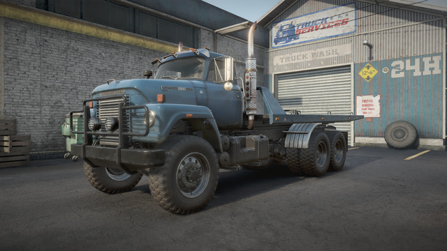
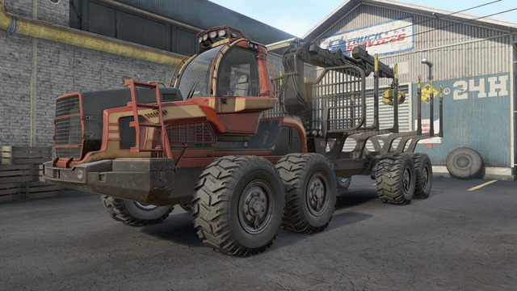

# SnowRunner Vanilla++

This mod was created to address the feelings of "I'd love to drive this truck more, but it can't pull this or carry that or gets stuck / tips over too often" that you get as you progress through the game.

If you feel like half the trucks in your garage are just not worth using anymore by the time you reach Taymyr, you might be the target audience for this.

**Note:** While the primary goal of this mod isn't to make the game easier, that *will* happen as a side effect of the changes it makes. If you already find this game too easy, this mod is not for you.

-----

# Normal Install

1. Grab the latest release from here: https://github.com/vsTerminus/SnowRunner/releases/latest

2. Download `initial.zip` and unpack it. Place `initial.pak` in `Steam/steamapps/common/SnowRunner/preload/paks/client/` and overwrite the original when prompted.

You will need to repeat this every time SnowRunner receives a patch, or if you ever have Steam validate the files (including moving the game to a new location). If you forget to do this and load up your profile, any modifications you made to your trucks that weren't possible in Vanilla will get reset.

If you decided to make a backup of the original initial.pak you should move it out of the "client" folder, as the game will attempt to load _all_ .pak files in this location, including your backup.

# Uninstall

Have Steam verify files. It will download a fresh copy of `initial.pak`.

# Manual Install (For Modders)

If you want to modify my files with your own changes, or just prefer to install things manually, here are the steps. **Regular Users can ignore these steps.**

In your `Steam/steamapps/common/SnowRunner/preload/paks/client/` directory you will find a file called `initial.pak`. Open it with **WinRAR**.

Yes, WinRAR. The short explanation is that other archive tools such as 7zip don't read Snowrunner .pak files correctly, or sometimes they can read and extract but cannot update them and that is what we need to do here. For whatever reason, WinRAR "just works" with SnowRunner's .pak files. Even on Linux, your best bet is to just install the Windows version of WinRAR using WINE, specifically wine-ge.

With `initial.pak` open, simply drag in the `[media]` folder from this repository and click OK. WinRAR will overwrite the existing files with the ones from this mod. When it finishes you can close WinRAR and launch SnowRunner as normal.

------

# General Changes

These are things that apply broadly across the game rather than to a specific truck.

## Fuel Rebalancing

I've rebalanced the tank size or fuel consumption rate of mostly every truck in the game. The starting point was the **"Fuel capacities based on real data" by ElfVierzhen** mod, but since that mod disappeared I have continued to balance new trucks and re-balance the old ones too.

The goal is that trucks should be able to drive for 30-50 minutes on a tank. Not 10 minutes like in vanilla, but also not for 6 hours like some of the trucks could after ElfVierzhen's changes.

I don't want fuel to be a completely irrelevant mechanic, just not something that you're forced to constantly think about. I want fuel trucks to be useful *sometimes*, not on every trip.

## Tire Rebalancing

I've also rebalanced all tires in the game. There are two goals here:

1. Tires shouldn't be artifically bad for "balance" reasons
2. Tires should mostly just be a cosmetic preference, otherwise you will always pick the "best" one and most tires will go unused

For the most part I took the best vanilla tires and then used their stats as a baseline. From there I boosted things like asphalt performance so trucks don't slide around so much on paved roads.

### All tires ignore ice

The only option the game provides is a true/false toggle for "ignore ice". Either tires ignore ice or they don't, and there's no in-between. I can't make tires "a bit better", it's all or nothing.

I could have made duplicates of tires and put them in the snow tires category but they wouldn't have been visually different and would just take up more space.

It made the most sense to me to simply have all tires ignore ice altogether.

## Camera Clipping Improvements

My mod includes the **"Camera Clipping Fix" by McKillem** mod.

https://mod.io/g/snowrunner/m/manual-camera-clipping-fix

This mod stops the camera from launching into the sky whenever it hits objects like telephone poles and watchtowers by removing the camera collision from them. It does not affect larger solid objects (like buildings). This is a really nice QoL thing I could not go back to playing without.

## All trucks purchaseable anywhere

Restricting truck purchases to specific regions was always dumb. There was nothing stopping you from just loading another map, buying the truck, and then going back. Removing this restriction just saves you time staring at loading screens.

Applies to all trucks in the game.

## Engine Power Rebalancing

Some of the engines (eg, "Russian Modern Scout" and "US Old Top") were just severely underpowered for the vehicles they were matched with.

I've tried to make sure that trucks can actually move under their own power, can climb a hill, and can pull a thing or two.

## Fuel Tank Rebalancing

In addition to not wanting players to need a fuel truck for every mission, one fuel truck should be enough to do the job. So I've improved the capacity of most fuel trailers/addons.

- "Fuel Tank" frame addon capacity increased from 1500 to 2500
- "Long Fuel Tank" frame addon capacity increased from 2800 to 4000
- "Tatra Fuel Tank" frame addon capacity increased to 2500
- "Crocodile Fuel Tank" frame addon capacity increased from 900 to 1500

## Farm Trailers can be packed on the towing frame

This change reduces the number of wheels required to make contact with the towing platform in order for the "Pack Trucks and Trailers" option to appear. The default is 4, this reduces it to 2. Packing the farm trailers is still sketchy as all hell and doesn't work *great*, but at least you can do it now.

-----

# Truck-Specific Changes

These changes are made to affect a single truck. In most cases it will mean larger tire sizes  and the addition of or changes to AWD and Diff Lock. Sometimes there are additional engine options, additional frame addons, weighted bumpers, and new or modified suspension options as well.

For the smaller trucks, these changes aim to make them feel "viable" in late game and in DLC regions by giving them the things there doesn't seem to be a good reason for them *not* to have; Larger tires, taller suspension, more power, and sometimes room for more attachments where it makes sense and there is room.

In the case of the superheavies, they are already viable late game but many of them only get access to saddles and heavy cranes making them very situational picks, or you use them anyway and just drag stuff around with the winch. Neither is very appeaing. So if these trucks have room on the frame for minicranes and flatbeds and van bodies and logging racks then I say "Why not?"

Hopefully this helps with feelings of "I want to drive this truck but because it doesn't have X or can't pull Y or gets stuck so easily it stays in my garage".

### BOAR 45318
- Can fit 61" Tires
- Has access to heavier tires including mud singles
- Can fit flatbed, sideboard bed, and a low saddle
- Converted High suspension into Active suspension

-----

### GMC MH9500
- Can fit 51" tires
- Has a manual diff lock
- Gets a High Hauling suspension
- Gets a weighted front bumper for heavy towing
- Gets improved saddle placement
- Engine fuel consumption reduced to be in line with similar engines

-----

### Derry Longhorn 4520
- Gets an additional, even more powerful engine
- Gets Active suspension
- Gets two larger tire sizes (53" and 55")

-----

### Zikz 605r
- Can fit a Low Saddle
- Gets a Bandit Crane
- Gets Active Suspension
- Tires from the JAT DLC now match the size of the Vanilla tires (They were 10" smaller)
- Can pull scout trailers
- Can fit articulated towing platform
- Can fit 1-slot flatbed

-----

### Pacific P12W
- Can fit 3-slot flatbed and sideboard
- Gets manual locking diff
- Gets access to Derry Longhorn 4520 engines
- Gets 65" and 69" tires

-----

### Pacific P16
- More powerful engines
- Three larger tire sizes
- Superheavy Single tires
- All Wheel Drive
- Short and Medium Logging Frame Addons
- CAT 745C Logging Frame Addon
- Articulated Towing Platform

-----

### Pacific P512
- Can fit 59" tires
- Now has All Wheel Drive
- Can fit a crane and a van body at the same time (I know, weird combo. But there's room so why not?)
- Increased engine power

-----

### Ford CLT9000
- Gets Limited Slip (Always-On) Diff
- Gets All Wheel Drive
- Gets 45" Tires

-----

### International Transtar 4070A
- Gets All Wheel Drive
- Gets Limited Slip (Always-On) Diff
- Gets 43" and 47" tires

-----

### International Paystar 5070
- Can fit 49" and 52" tires
- Installed a level-kit (Raised the height of rear suspension to match the height of the front)
- Added two more engine options

-----

### International Paystar 5600TS
- Can fit 55" tires
- Can fit a High Saddle
- Can fit an Articulated Towing Platform
- Can fit a rear mounted Log Lift
- Can fit a rear mounted Minicrane
- Moved most frame addons forward for better weight distribution
- Possible to fit a 2 slot flatbed and a low saddle at the same time

-----

### International Fleetstar F2070A
- Can fit 47" tires

-----

### Royal BM17
- Gets Limited Slip (Always-On) Differential

-----

### Chevy Kodiak C70
- Can fit 47" tires
- Tires have a much wider stance for improved stability
- Can fit heavy tires, both double and singles
- Can fit several new kinds of Frame Addons, including the F-750's pickup bed, log bunks, fuel/water tanks, 1-slot flatbed, 2-slot flatbed, big crane, and articulated towing platform
- Can fit multiple frame addons at a time where it makes sense (eg radar + utility addon + pickup bed)
- Can pull scout trailers
- Can fit medium autonomous winch
- Can fit a larger, more powerful engine
- Saddles moved closer to the axle for improved stability
- Can fit weighted bumper for heavy hauling
- Gets "High Hauling" and "Tuned Custom" suspensions
- Moved to the "Scout" category

-----

### TUZ 16 Actaeon
- Can fit saddles
- Can fit a weighted bumper
- Can pull scout trailers
- Moved to Scout category

-----

### Kolob 74760
- Gets High Suspension
- Can fit 65" tires
- Can fit logging beds
- Can fit a Low Saddle
- Improved High Saddle location, slightly raised articulation point
- Gets Articulated Towing Platform
- Reduced mass by ~25%

-----

### Voron Grad
- Can fit 54" tires

-----

### Khan 317 Sentinel
- Can fit 45" tires

-----

### Freightliner 114SD
- Gets access to an additional, more powerful engine
- Can fit 51" tires

-----

### Step 310E
- Can fit 47" tires
- Increased height of "Raised" Suspension
- Added a "High Hauling" Suspension

-----

### Step 33-64 "Crocodile"
- Can fit 44" tires
- Can fit heavy tires
- Increased height of the "Raised" Suspension
- Can fit Medium Autonomous Winch
- Can pull Scout Trailers
- Moved to "Scout" category
- Gets a weighted bumper to help with steering while towing
- AWD and Diff Lock converted from always-on to selectable
- Can fit the 1-slot flatbed

-----

### YAR 87
- Gets an additional, more powerful engine option

-----

### Tatra T813
- Can fit 55" tires
- Can fit a Low Saddle
- Can fit a 1-slot flatbed
- Can fit a minicrane or a bandit crane

-----

### Tatra FORCE T815-7
- Can fit 54" and 57" tires
- Can fit a Low Saddle

-----

### Tatra PHOENIX
- Can fit 49" and 52" tires
- Moved crane up against the cab
- Can fit a Low Saddle

-----

### GMC Brigadier 8000
- Can fit 48" and 51" tires
- Gets a weighted bumper for towing

-----

### White Western Star 4964
- Can fit 47" and 51" tires
- Gets a weighted bumper for towing

-----

### Azov 42-20 Antacrtic
- Converted to traditional steering with improved turning radius and responsiveness
- Slightly wider stance for improved stability
- Price reduced to 90000, unlocks at level 10 (instead of 26)
- Gets access to Derry Longhorn 4520 Engines for better power to weight ratio
- Gets CAT CT680's horn sound
- Gets selectable All Wheel Drive
- Can fit several new attachments including heavy crane, logging bunks, flatbeds and sideboards, minicranes, tanks, and more

-----

### Western Star 6900 TwinSteer
- Can fit 63" tires
- Lowered center of gravity for improved stability

-----

### Rezvani Hercules 6x6
- Can fit duallies

-----

### Land Rover Defender 90
- Can fit 35" tires

-----

### Land Rover Defender 110
- Can fit 35" tires

-----

### Western Star 57X
- Can fit 46" and 47" tires
- Gets manual locking diff

-----

### Western Star 47X NF1424
- Can fit 51" tires

-----

### Western Star 47X NF1430
- Gets Manual Diff Lock
- Gets 3-Slot Flatbed and Sideboard
- Can fit 47" and 50" tires
- Can fit mud tires

-----

### Kirovets K-700
- Improved turning radius
- Improved steering responsiveness

-----

### Kirovets K-7M
- Gets selectable AWD
- Gets manual diff lock
- Improved turning radius
- Improved steering responsiveness
- Raised intake height to match visible snorkel

-----

### Kenworth W990
- Gets AWD
- Gets manual diff lock
- Can fit 55" tires

-----

### Kenworth 963
- Gets manual diff lock
- Engine torque increased

-----

### Navistar 5000-MV
- Gets always-on (limited slip) differential
- Can fit 52" tires
- Can fit 1-slot flatbed
- Moved to the Highway category

-----

### Ank Mk38 Civilian
- Can fit articulated towing platform
- Can fit 2-slot frame-addons
- Can fit a minicrane

-----

### KRS 58 Bandit
- Can fit 55" tires
- Can fit articulated towing platform
- Can fit regular minicrane

-----

### FEMM 37-AT
- Converted to traditional steering
- Gets selectable AWD
- Can fit long tanks
- Can fit the Tatra crane
- Can fit logging bunks
- Can fit articulated towing platform
- R2 engine produces slightly more power
- R2 engine consumes less fuel
- Minicrane moved to back of the frame
- Can fit the Azov Atom's 3-slot sideboard bed
- Can fit both forward-facing and rear-facing log lifts, both mounted at the rear of the frame

-----

### Mack Defense M917
- Can fit 54" tires

-----

### Aramatsu Forester
- Can fit 55" tires
- Shares engines with K7M

-----

### Azov 67096 "Atom"
- Can fit FEMM 4-slot Sideboard

-----

### Burlak 6x6
- Engine power and durability increased
- Tires now inherit stats from the "ScoutMudtires" template instead of "Offroad"

-----

### Azov 64131
- Can fit 51" tires
- Gets a modest Raised suspension
- Reduced mass by ~24%

-----

### CAT 770G
- Gets always-on AWD
- Gets improved steer speed
- Can fit non-JAT Superheavy Single tires
- Can fit regular Low and High Saddles

-----

### Kenworth C500
- Gets "Raised" suspension option
- Can fit 54" tires, including superheavy singles

-----

### Kenworth T880
- Increased "Raised" suspension ride height
- Can fit 51" tires, including mud tires
- Gets selectable diff lock (was always-on / limited slip)
- Gets selectable AWD (was RWD)

-----

### Mack Terra Pro
- Can fit 49" wheels. including mud tires
- Gets always-on AWD (was RWD)
- Improved the strength of the suspension
- Slightly raised the rear end suspension

-----

### Mack Pinnacle
- Can fit 47" wheels

-----

### Derry Special 15C-177
- Can fit Low Saddle

-----

### Khan 39 Marshall
- Can pull scout trailers

-----

### PLAD 450
- Improved engine power
- Improved engine fuel efficiency

-----

### Kolob 74941
- Reduced mass by ~26%

-----

### Zikz 612H Mastadon
- Re-geared transmissions for faster and smoother acceleration
- No changes to top speed
- High Gear speed improved (Closer to 5th gear instead of 2nd gear)

-----

### Sleiter 816 Elephant
- Improved engine power so it can climb hills
- Added Low Saddle

-----

### Sleiter 833 Behemoth
- Gets the Sleiter 816's engine
- Gets a Low Saddle
- Gets additiona Log Bunks

-----

### Derry Longhorn 3194
- Gets larger wheels
- Gets Active Suspension
- Ride height tweaks to standard suspension

-----

### Ford F-750
- Can pull scout trailers
